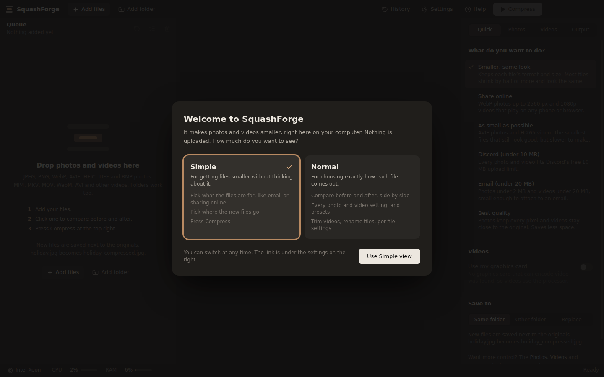
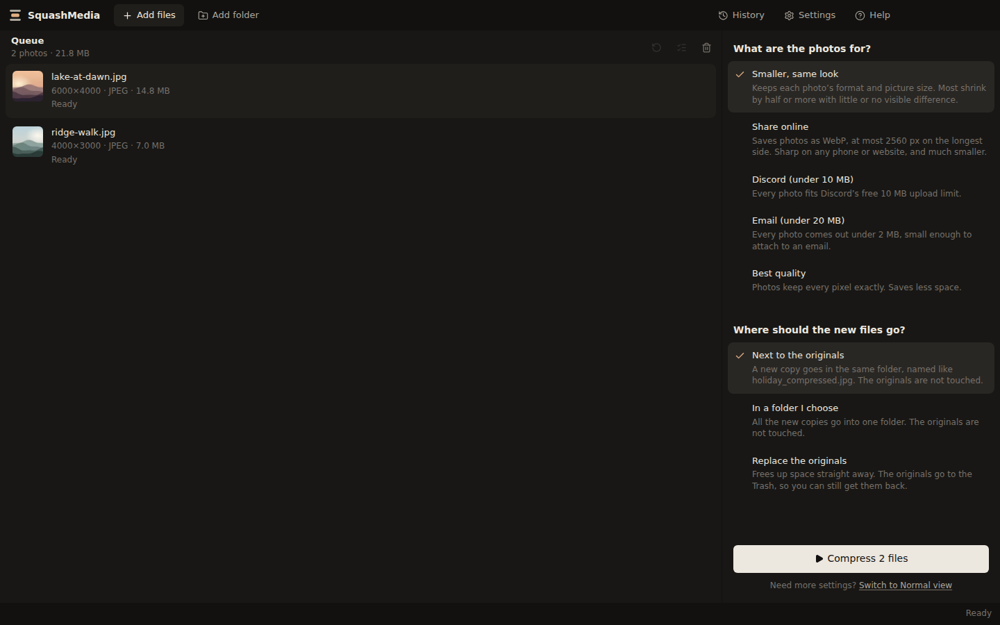
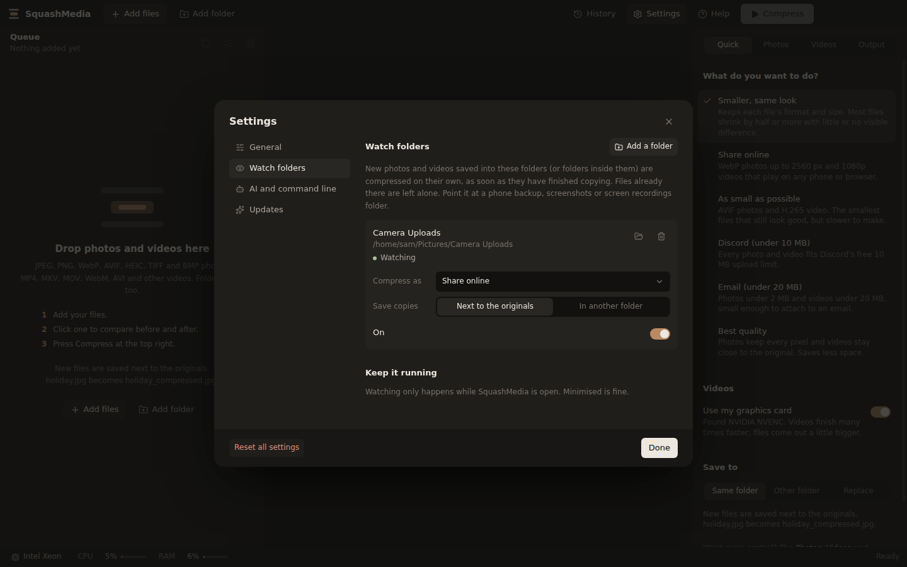
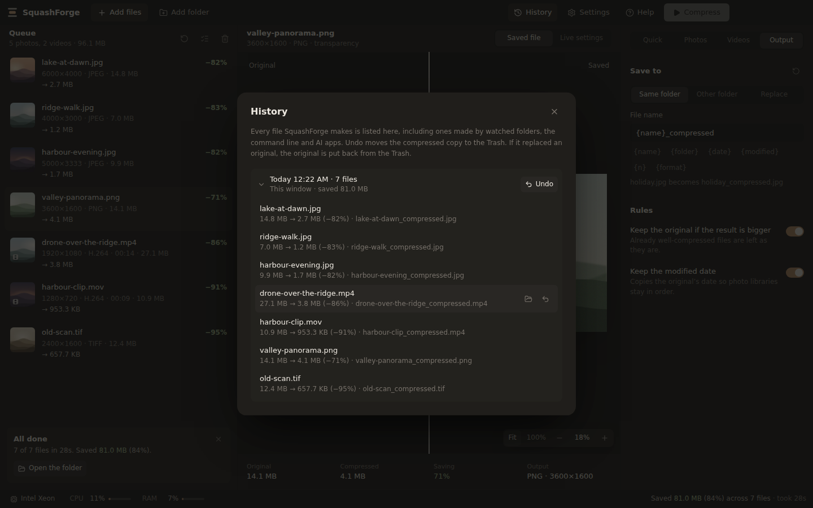
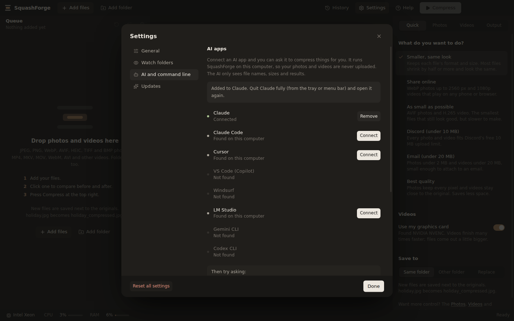

# SquashMedia

SquashMedia makes photos and videos smaller. You drop files in, check the before and after side by side, and press one button. It runs on Windows 10 and 11, macOS and Linux.

With the default settings most photos and videos from phones and cameras shrink by half or more, and the difference is hard to see. That isn't guaranteed for every file: something that was already compressed hard may barely shrink, and a low quality setting or a small size limit will show. Your originals are kept unless you choose otherwise, and if a new copy would come out bigger, SquashMedia keeps the original instead. Use the side-by-side comparison to check before you commit.

It does the job of two well-known free tools in one window: Caesium for photos and HandBrake for videos. Nothing is uploaded anywhere. Everything happens on your own computer.


## Contents

- [Install it](#install-it)
- [Compress your first files](#compress-your-first-files)
- [Lots of videos? Use your graphics card](#lots-of-videos-use-your-graphics-card)
- [Watch folders](#watch-folders)
- [History and undo](#history-and-undo)
- [Let an AI app do it for you](#let-an-ai-app-do-it-for-you)
- [The squashmedia command](#the-squashmedia-command)
- [Common jobs, step by step](#common-jobs-step-by-step)
- [What the settings mean](#what-the-settings-mean)
- [Something went wrong](#something-went-wrong)
- [Keyboard shortcuts](#keyboard-shortcuts)
- [For developers](#for-developers)
- [Legal](#legal)

## Install it

SquashMedia's code and downloads live on GitHub, in the project called **squash-media**. Open the [latest release page](https://github.com/joshov13-dev/squash-media/releases/latest) and scroll down to **Assets**. Pick the file for your computer from the table, then follow the steps for it below. Ignore the two **Source code** files; those are for programmers. If the Source code files are the only ones you can see, the release is brand new and its downloads are still being built. Wait ten minutes and refresh the page.

| Your computer | Download |
| --- | --- |
| Windows | `SquashMedia-Setup-0.5.0-x64.exe` (the version number may be higher) |
| Mac with an Apple chip (M1, M2, M3, M4...) | `SquashMedia-0.5.0-mac-arm64.dmg` |
| Older Mac with an Intel chip | `SquashMedia-0.5.0-mac-x64.dmg` |
| Linux (Ubuntu, Mint, Debian) | `SquashMedia-0.5.0-amd64.deb` |
| Other Linux | `SquashMedia-0.5.0-x86_64.AppImage` |

The downloads are big (about 160 MB on Windows, 160 to 180 MB on a Mac and 210 MB on Linux, measured on version 0.4.0) because each one contains everything it needs, including its own copy of FFmpeg for video. Once installed it takes about 650 MB of disk space (measured on Linux). Nothing else needs installing. Apart from checking GitHub for new versions (which you can turn off), it doesn't go online.

Not sure which Mac you have? Click the Apple menu at the top left and choose **About This Mac**. If it says **Chip: Apple M...**, take the arm64 one. If it says **Processor: Intel**, take x64.

### Windows

1. Open your Downloads folder and double-click the Setup file you just downloaded.
2. Windows will probably show a blue box that says **Windows protected your PC**. Don't worry: Windows shows this for any new program that hasn't paid for a code-signing certificate, and SquashMedia hasn't (yet). To get past it:
   - Click the small underlined words **More info**, just under the message. At first the only button is **Don't run**, so it's easy to miss.
   - The box now shows the file name and a second button, **Run anyway**. Click **Run anyway**.

   You only need to do this once. Later versions install themselves (see [Updates](#updates)).
3. The installer asks a couple of questions. The answers it already has are fine, so keep clicking **Next**, then **Install**, then **Finish**.
4. SquashMedia opens. Next time, click the Start button and type `SquashMedia`, or use the shortcut on your desktop.

**Would rather not install anything?** Download `SquashMedia-Portable-0.5.0-x64.exe` instead and double-click it. You'll get the same blue box the first time: click **More info**, then **Run anyway**. It runs straight away without installing, but it opens a few seconds slower each time, doesn't update itself, and can't add the right-click menu in File Explorer or connect to AI apps.

**Removing it:** open **Settings**, then **Apps**, find **SquashMedia** and click **Uninstall**. Your photos and videos are not touched.

### Mac

SquashMedia isn't notarised by Apple, because that needs a paid Apple developer account. It is signed "ad hoc", which is enough for it to run on Apple silicon Macs, but macOS still stops it the first time you open it. You only need to get past this once.

1. Double-click the `.dmg` file in your Downloads folder. A window opens with the SquashMedia icon and your Applications folder.
2. Drag SquashMedia onto the Applications folder, then close the window.
3. Open your Applications folder and double-click SquashMedia. macOS says it can't check the app, or that it can't be opened. Click **Done** (not **Move to Bin**).
4. Open **System Settings**, go to **Privacy & Security** and scroll down to **Security**. Next to the message about SquashMedia, click **Open Anyway**, enter your password if asked, then click **Open**.

   On macOS 14 (Sonoma) and earlier you can skip step 4: **right-click** SquashMedia, choose **Open**, then click **Open** in the box that appears.
5. If macOS says the app **is damaged and can't be opened**, and there's no **Open Anyway** button, open the **Terminal** app, paste this line, press Return, and open SquashMedia again. It removes the "downloaded from the internet" mark that macOS puts on the app.

   ```bash
   xattr -dr com.apple.quarantine /Applications/SquashMedia.app
   ```

**Removing it:** drag SquashMedia from Applications to the Bin.

### Linux

- **The .deb file** (Ubuntu, Linux Mint, Debian, Pop!_OS): double-click it and click **Install**, or run `sudo apt install ./SquashMedia-0.5.0-amd64.deb` in the folder you downloaded it to. SquashMedia then appears in your apps menu.
- **The AppImage** (any other Linux): right-click it, open **Properties**, tick **Allow executing file as program**, then double-click it. Or in a terminal: `chmod +x SquashMedia-*.AppImage && ./SquashMedia-*.AppImage`. The AppImage can't connect to AI apps, because it moves each time it runs; use the .deb for that.

### Updates

SquashMedia checks for a new version when it starts and every few hours after that.

- **Installed on Windows, or the Linux AppImage:** the new version downloads in the background. When it's ready, **Restart to update** appears at the top of the window. Click it, or just carry on: it installs the next time SquashMedia starts.
- **Mac, the Windows portable version and the .deb:** these can't replace themselves, so a dot appears on **Settings**. Open **Settings**, then **Updates**, and click **Download** to get the new version from the release page.

You can turn the checks off, or check straight away, in **Settings** > **Updates**.

## Compress your first files

### Simple or Normal view

The first time SquashMedia opens, it asks how much you want to see.



- **Simple** is for getting files smaller without thinking about settings. You pick what the files are for (email, sharing online, Discord and so on), pick where the new files go, and press the big **Compress** button.
- **Normal** adds the before and after comparison, every photo and video setting, presets, video trimming and file naming. The steps below describe Normal view.



You can switch whenever you like. Use the link under the settings on the right, or **Settings** > **General** > **View**.

### 1. Add your files

Drag photos or videos from File Explorer (Finder on a Mac) onto the SquashMedia window. You can drag a whole folder too; SquashMedia finds every photo and video inside it, including in subfolders. If you prefer buttons, use **Add files** or **Add folder** at the top left.


Your files appear in the list on the left, called the queue. You can mix photos and videos, including iPhone photos (HEIC).

### 2. Check what you'll get

Click any photo in the queue. The big picture in the middle is split in two: the left half is your original, the right half is how it will look after compressing. Drag the round handle in the middle left and right to compare.

The numbers under the picture tell you the original size, the new size and how much you save.

To look closely, scroll your mouse wheel over the picture to zoom in, and drag to move around. Double-click to jump to 100% (one screen pixel per photo pixel) and double-click again to go back.

For a video, click **Preview sample**. SquashMedia compresses 4 seconds from the middle of the video, shows you the same frame before and after, and estimates the final size and how long the whole video will take.

### 3. Say what you want (optional)

The panel on the right opens on the **Quick** tab. Pick what you want from the list and every photo and video setting is chosen for you. The first one, **Smaller, same look**, is already picked and suits most files, so you can skip this step.

| Pick this | When |
| --- | --- |
| Smaller, same look | You want smaller files with no difference you'd normally notice. Keeps each file's type and picture size. |
| Share online | Photos and videos are going on a website or social media. |
| As small as possible | Space matters most and you don't mind waiting a bit longer. |
| Discord (under 10 MB) | You're posting to Discord without Nitro. |
| Email (under 20 MB) | You're attaching things to an email. |
| Best quality | Nothing may look any different. Saves less space. |

The Quick tab also has **Use my graphics card** (see [below](#lots-of-videos-use-your-graphics-card)) and where to save the new files.

Only the settings that apply are shown. With just photos in the queue, the **Videos** tab and the graphics card switch are hidden, and each choice describes what it does to photos. With just videos, it's the other way round.

Want more control? The **Photos**, **Videos** and **Output** tabs have every setting, and each has its own preset menu at the top:

| Preset | Use it when |
| --- | --- |
| Balanced | You want smaller photos that look much the same. |
| Web (WebP) | Photos are going on a website. |
| Smallest (AVIF) | Every kilobyte counts and you don't mind waiting a bit longer. |
| Lossless | Not a single pixel may change. Saves less space. |
| Under 500 KB, Under 2 MB | A form or website has a file size limit. |
| Standard (H.264) | You want a smaller video that plays on anything. |
| HQ 1080p (H.265) | You want the smallest file at high quality and your devices are less than about 8 years old. |
| Discord (10 MB), Discord (50 MB) | You're posting a video to Discord. |
| Email (20 MB) | You're attaching a video to an email. |

### 4. Press Compress

Click **Compress** at the top right. Each file shows its progress and how long it has left. The bar at the bottom of the window shows the whole queue.


You can keep using your computer while it works, but it may feel slower than usual because SquashMedia uses the whole processor. If that bothers you, turn on **Keep the PC responsive** in **Settings**. Your computer won't go to sleep on its own until the queue is finished.

### 5. Find your new files

When everything is done, an **All done** box appears under the queue. Click **Open the folder** to see your new files.


Unless you change it, each new file is saved next to its original with `_compressed` added to the name. So `holiday.jpg` becomes `holiday_compressed.jpg`. Your originals are left alone.

SquashMedia never writes over a file that's already there. If the name is taken (say you compress the same photo twice), the new copy gets a number: `holiday_compressed (2).jpg`.

If a compressed file would come out bigger than the original (it happens with files that were already squeezed hard), SquashMedia keeps the original and says so.

## Lots of videos? Use your graphics card

Compressing video on the processor is slow. Most graphics cards from the last eight years or so have a separate video encoder built in, and it is many times faster: often the difference between a whole day and an hour or two for a big pile of videos. SquashMedia works with NVIDIA (NVENC), Intel (Quick Sync) and AMD (AMF) on Windows and Linux, and with Apple's VideoToolbox on every Mac.

You don't need to do anything to turn it on. The video encoder is set to **Auto** from the start. Auto uses your graphics card if SquashMedia found one that works when it opened, and the processor if not. To check, look at **Use my graphics card** on the **Quick** tab. It is switched on, and names your card's encoder, when one was found.


The trade-off is size: for the same quality, a graphics card makes files a little bigger than the processor does. Switch **Use my graphics card** off (or choose **CPU** as the encoder on the **Videos** tab) when you want the smallest possible files and have time to wait.

If the graphics card ever fails on a file, for example because of an old driver, SquashMedia redoes that file on the processor and carries on with the rest. The file shows a short note saying so.

### Settings for big batches

Click **Settings** at the top of the window. The **General** section has these:


| Setting | What it does |
| --- | --- |
| Videos at once | How many videos are compressed side by side. With a graphics card, 2 or 3 gets a big batch done sooner. On the processor, leave it at 1. |
| Photos at once | How many photos are compressed side by side. **Auto** picks a number for your processor. |
| Read videos on the graphics card too | The graphics card also reads (decodes) the original video, taking more work off the processor. If it can't read a file, SquashMedia reads that one on the processor instead. |
| Keep the PC responsive | Runs compression at a lower priority so games, video calls and other programs stay smooth. Takes a little longer. |
| Leave out earlier copies | When you add a folder, files named like your earlier results (such as `holiday_compressed.jpg`) are left out, so nothing gets compressed twice. |
| Skip files that are already done | If a file's compressed copy already exists, leave it. Handy for carrying on with a big batch another day: add the same folder again and press **Compress**. |
| Stop the PC going to sleep | Keeps the computer awake while files are being compressed, then lets it sleep as normal. |
| Show a notification when it finishes | Pops up a notification when the queue is done and you're using another program. |
| Ask before quitting mid-way | Warns you if you close SquashMedia while it's still working. |

**Reset all settings** at the bottom puts everything, including the tabs on the right, back to how it was on first launch. Presets you saved are kept.

A tip for really big jobs: add one folder at a time and use **When done** at the bottom of the window to put the computer to sleep when it's finished.

## Watch folders

SquashMedia can keep an eye on a folder and compress every new photo or video that lands in it: your phone's camera backup, your screenshots, or where your screen recorder saves. It waits until each file has finished copying, so half-copied videos are never touched. Files already in the folder are left alone.



1. Open **Settings** and choose **Watch folders**.
2. Click **Add a folder** and pick the folder.
3. Under **Compress as**, pick one of the Quick tab goals.
4. Under **Save copies**, choose **Next to the originals** (named like `IMG_0042_compressed.jpg`) or **In another folder**.

New files join the queue and start straight away, with a short note at the top of the queue. Watching only works while SquashMedia is open, but minimised is fine. On Windows and Mac, turn on **Open SquashMedia when I sign in** and it starts minimised with the computer, so watching carries on after a restart.

## History and undo

Changed your mind? Click **History** at the top of the window. Every file SquashMedia has made is listed there, newest first, including files made by watched folders, the command line and AI apps.



- **Undo** next to a run undoes the whole run. Click the run to see its files and undo just one.
- Undo moves the compressed copy to the Recycle Bin (the Bin on a Mac).
- If you used **Replace**, undo also puts the original back from the Recycle Bin, where SquashMedia sent it. This only works while the original is still in the Recycle Bin, so don't empty it until you're happy.

## Let an AI app do it for you

If you use an AI app such as Claude, Cursor, VS Code's Copilot or LM Studio, you can connect SquashMedia to it and just ask. For example:

- "Shrink every video in my Downloads folder to 1080p"
- "Make the photos in Desktop\Wedding small enough to email"
- "Convert these HEIC photos to JPEG and put them in a new folder"
- "How much space would I save compressing my Videos folder?"

The AI app runs SquashMedia on your computer, so your photos and videos are never uploaded. The AI only sees file names, sizes and the results. It follows the same rules as the window: copies are saved next to the originals unless you ask for something else, it only replaces originals if you clearly ask it to, and every run can be undone from **History**.

### Connecting an app



1. Install SquashMedia with the Setup file (Windows), from the disk image into Applications (Mac), or with the .deb (Linux). The portable version and the AppImage can't be connected.
2. Open **Settings** and choose **AI and command line**. SquashMedia lists the AI apps it found on your computer.
3. Click **Connect** next to the app. SquashMedia adds itself to that app's settings and keeps a copy of the old settings file next to it, ending in `.before-squashmedia`.
4. Restart the AI app (the message tells you exactly what to do). You should now see SquashMedia's tools in the app, and you can start asking.

SquashMedia can connect itself to **Claude** (the desktop app), **Claude Code**, **Cursor**, **VS Code** (Copilot in agent mode), **Windsurf**, **LM Studio**, **Gemini CLI** and **Codex CLI**. Click **Remove** to take it out again.

Any other app that supports MCP servers works too. Open **Another AI app, or setting it up by hand** in the same section and copy the settings into that app's MCP settings.

### What the AI can do

SquashMedia gives the AI app these tools. The app usually asks you before using them.

| Tool | What it does |
| --- | --- |
| get_capabilities | Tells the AI what SquashMedia can do on this computer: goals, file types and which graphics card encoders work. |
| inspect_media | Reads files or folders and reports sizes, resolutions, durations and formats. Changes nothing. |
| estimate_size | Tries the settings on one file and reports the likely size (and for video, how long it will take). Saves nothing. |
| compress_media | Compresses files and folders. It can do a dry run first, to show what would happen. |
| get_compression_status | Progress, time left and results for a batch that is still running. |
| cancel_compression | Stops a batch. Finished files are kept. |
| list_history | Recent runs from the window, watched folders, the command line and AI apps. |
| undo_compression | Undoes a run, or some of its files. |

Keep the AI app open while a long batch runs: closing it stops the batch (files that already finished are kept).

## The squashmedia command

For scripts, or if you like typing, SquashMedia has a command line tool. It uses the same goals as the Quick tab, the same settings folder as the window, and its runs appear in **History**.

To install it, open **Settings**, choose **AI and command line**, and click **Install the squashmedia command**. Then open a new terminal window (Command Prompt or PowerShell on Windows).

```text
squashmedia compress "D:\Phone backup" --goal share
squashmedia compress clip.mov --goal discord
squashmedia compress ~/Videos --resolution 1080p --out ~/Videos/small
squashmedia compress *.png --format webp --quality 80 --dry-run
squashmedia inspect ~/Pictures
squashmedia history
squashmedia undo 7042d418-cli
squashmedia help
```

| Option | What it does |
| --- | --- |
| `--goal` | `smaller` (default), `share`, `smallest`, `discord`, `email` or `quality` |
| `--out <folder>` | Save copies into this folder, keeping subfolders |
| `--replace` | Replace the originals, which go to the Recycle Bin |
| `--name <pattern>` | Name pattern, for example `"{date} {name}"` |
| `--target <size>` | Largest size for each file, for example `500KB` or `10MB` |
| `--format`, `--quality`, `--max-size`, `--lossless`, `--keep-metadata` | Photo settings |
| `--codec`, `--crf`, `--resolution`, `--fps`, `--encoder`, `--no-audio` | Video settings |
| `--dry-run` | Show what would happen without writing anything |
| `--json` | Print the result as JSON, for scripts |

It exits with 0 when everything worked, 1 when a file failed and 2 when the command itself was wrong.

## Common jobs, step by step

### Make a video small enough for Discord

On the **Quick** tab, pick **Discord (under 10 MB)** and press **Compress**. (To do it for one video only, click the video, open the **Videos** tab, choose **This video only** and then **Discord (10 MB)** from the preset menu.) SquashMedia works out the right quality for the length of your video. If the result still comes out too big, it tries again automatically.

For a different limit, change **Quality** to **Target size** and type the size in MB.

### Cut the start or end off a video

Click the video and open the **Videos** tab. Under **Trim**, drag the two dots on the slider, or type the start and end times (for example `0:02` and `1:15`). The trim only applies to that one video.


### Turn iPhone photos (HEIC) into JPEGs

Add the `.heic` files and press **Compress**. With the format on **Same**, HEIC photos come out as JPEG, because hardly anything else can write HEIC and JPEG opens everywhere. Choose **WebP** or **AVIF** on the **Photos** tab for smaller files. If **Strip metadata** is off, the date taken and location are kept.

### Get photos under a size limit

Choose **Under 500 KB** or **Under 2 MB** from the Photos preset menu. For any other size, choose **Max size** under **Compression** and type the limit. SquashMedia picks the best quality that fits. If even the lowest quality is too big, it shrinks the photo until it fits.

### Give one file different settings

Click the file, then choose **This photo only** (or **This video only**) at the top of the settings. Anything you change now only affects that file, and the queue marks it with "own settings". Choose **All photos** to put it back on the shared settings.

### Save everything into one folder

On the **Quick** or **Output** tab, choose **Other folder** and pick where the files should go. If you added a whole folder, **Keep subfolders** recreates its layout inside the destination, so two files called `IMG_0001.jpg` from different days won't clash.

### Choose how new files are named

Open the **Output** tab. **File name** is a pattern: `{name}_compressed` is the default. Click the buttons under it to add a piece. For example, `{date} {name}` turns `beach.jpg` into `2026-09-25 beach.jpg`, and `Trip-{n}` numbers them `Trip-001`, `Trip-002` and so on. The line underneath shows an example as you type.


When saving to another folder, files keep their names unless you turn on **Rename the files too**.

### Replace the originals

Open the **Output** tab and choose **Replace**. Each compressed file takes the original's place, and the original goes to the Recycle Bin. **History** can put it back, as long as you haven't emptied the Recycle Bin. If the original can't be moved to the Recycle Bin, SquashMedia leaves it alone and says so.

Changing the format in Replace mode (say PNG to WebP) gives the new file a new extension. If a file with that name is already there, the new one gets a number instead of writing over it.

### Compress straight from File Explorer

If you installed SquashMedia on Windows, right-click a photo, a video or a folder and choose **Compress with SquashMedia**. On Windows 11, click **Show more options** first. You can also select lots of files, right-click, and choose **Send to**, then **SquashMedia**. Dropping files onto the SquashMedia icon on your desktop works too.

### Let it run overnight

Once compressing has started, the bar at the bottom of the window shows **When done**. Choose **Sleep** or **Shut down**. When the queue finishes you get a minute to cancel before it happens.

### Pick a specific encoder

On the **Videos** tab, the **Encoder** row has **Auto**, **CPU**, and your computer's graphics card encoders: **NVENC** (NVIDIA), **QSV** (Intel) and **AMF** (AMD) on Windows and Linux, or **Apple** (VideoToolbox) on a Mac. Auto is right for almost everyone. Greyed-out options mean that graphics card isn't in your computer, or its driver is too old for it.

## What the settings mean

Most options have a short explanation right under them in the app. Here is the longer version.

### Photos

| Setting | What it does |
| --- | --- |
| Format | **Same** keeps each file's type (HEIC becomes JPEG, BMP becomes PNG). **JPEG** works everywhere. **PNG** is for graphics and screenshots. **WebP** is about 30% smaller than JPEG and fine for websites. **AVIF** is the smallest but slowest to make. |
| Quality | 1 to 100. Around 80 is hard to tell from the original for most photos. Below 60 you may start to see blotches. |
| Lossless | Makes the file smaller without changing any pixels. For JPEGs it removes hidden data only. Saves less than Quality mode. |
| Max size | Finds the best quality that fits under a size you choose. |
| Strip metadata | Removes hidden information such as the camera model and the GPS location where the photo was taken. On by default, for privacy. Photos are turned the right way up first. With **Max size** the information is always removed, to make room. |
| Resize | Makes photos smaller in pixels. **Percent** scales everything by the same amount. **Fit in box** keeps photos inside a width and height you choose. It never makes a photo bigger. |

### Videos

| Setting | What it does |
| --- | --- |
| Codec | **H.264** plays on everything. **H.265** makes files about half the size, but some older devices can't play it. **AV1** is the smallest but slow to make. **VP9** is mainly for websites. |
| Container | The file type: **MP4** for most uses, **MKV** keeps extra subtitle tracks, **WebM** is for websites. |
| Encoder | **Auto** uses your graphics card when it can and the processor when it can't. **CPU** gives the smallest files. The others force a particular graphics card encoder. |
| Speed | Slower settings squeeze the file harder at the same quality. |
| Quality | Lower numbers mean better quality and bigger files. The shaded part of the slider is the range most people use. |
| Target size | Aims for an exact file size instead of a quality level. |
| Resolution | Makes the picture smaller, for example 4K down to 1080p. It never makes a video bigger. |
| Frame rate | Caps the frames per second. 30 is plenty for most clips. |
| Audio | **Passthrough** keeps the sound exactly as it is. **AAC** and **Opus** re-compress it. **No audio** removes it. |
| Remove the location | Phones record where each video was filmed. SquashMedia removes that from the compressed copy unless you turn this off. The date it was filmed is kept either way. |

### Output

| Setting | What it does |
| --- | --- |
| Same folder | Saves the new file next to the original, named with the pattern in **File name**. |
| Other folder | Saves everything into a folder you choose. Names stay the same unless you turn on **Rename the files too**. |
| Replace | The new file takes the original's place. Originals go to the Recycle Bin, and **History** can put them back. If an original can't go to the Recycle Bin, it is left as it was. |
| File name | The pattern for new names. `{name}` is the original name, `{folder}` the folder it's in, `{date}` today's date, `{modified}` the date the file was last changed, `{n}` a number (001, 002...) and `{format}` the new file type. |
| Keep the original if the result is bigger | Leaves files alone when compressing wouldn't help. |
| Keep the modified date | Gives the new file the same date as the original, so photo apps keep them in order. |

Your settings are remembered the next time you open SquashMedia. The arrow button next to the preset menu puts a tab back to its defaults. The bookmark button saves your current settings as a preset of your own.

## Something went wrong

### "Windows protected your PC"

This is expected, for both the installer and the portable version. Click the small underlined **More info** under the message, then the **Run anyway** button that appears. Step 2 of [the Windows instructions](#windows) goes through it.

### The Mac says SquashMedia "is damaged" or "can't be opened"

macOS says this about apps that aren't notarised by Apple, which SquashMedia isn't. Follow steps 3 to 5 of [the Mac instructions](#mac).

### It says a part of SquashMedia (FFmpeg) is missing or damaged

FFmpeg is the part of SquashMedia that reads and writes videos and iPhone (HEIC) photos. It is inside every download, so this means the copy on your computer is incomplete: usually an antivirus program removed or blocked a file, or the download was cut short. Other photos still work.

Download SquashMedia again from the [release page](https://github.com/joshov13-dev/squash-media/releases/latest) and reinstall it (or replace the portable file). If it happens again straight away, check your antivirus's quarantine list for files from SquashMedia and allow them.

### A file has red text under it

That file couldn't be compressed, and the red text says why in plain words. Hover over it to see the technical details. The usual causes:

- The file is open in another program. Close it and click the circular arrow next to the file to try again.
- The disk is full, or you picked a folder you can't save to. Choose another folder in the **Output** tab.
- The file is damaged. Check it opens in another program.
- The graphics card failed and so did the processor. That usually means the file is damaged or in an unusual format.

If you think it's a bug, hover over the file and click the clipboard button (**Copy the details**), or click **Copy details** in the box under the queue. Then paste it into a [new issue](https://github.com/joshov13-dev/squash-media/issues/new). It includes the file's details and your settings, but not its folder, which could include your name. For anything that isn't tied to one file, see [Getting the log](#getting-the-log) below.

### It says "Original kept"

The compressed version would have been bigger than the file you started with, so SquashMedia left the original as it was. This is normal for files that were already compressed hard.

### I can't find my files

Click **Help** at the top of the window. It tells you exactly where new files are being saved with your current settings. You can also click the folder icon that appears when you hover over a finished file, or look in **History**.

### I replaced my originals by mistake

Open **History**, find the run and click **Undo**. The originals come back from the Recycle Bin. If you've emptied the Recycle Bin since, they can't be brought back.

### Compressing a video is slow

Video takes time, especially long 4K videos. First check that **Use my graphics card** is on in the **Quick** tab (see [Lots of videos? Use your graphics card](#lots-of-videos-use-your-graphics-card)). You can also pick **Fast** or **Fastest** under **Speed**, or a lower **Resolution**. The time left shown next to each file gets more accurate the more you use SquashMedia.

### "Use my graphics card" is greyed out

SquashMedia didn't find a graphics card it can use for video. Updating your graphics driver (from NVIDIA, Intel or AMD's website) and restarting SquashMedia often fixes it. Some older or very basic graphics chips have no video encoder at all; then videos use the processor.

### My computer is slow while it works

That is expected. SquashMedia uses every processor core to finish sooner. Turn on **Keep the PC responsive** in **Settings** to let other programs go first. It goes back to normal when the queue is done.

### A watched folder says it can't be found

The folder has been moved, renamed, or is on a drive that isn't plugged in. SquashMedia tries again every 30 seconds, so plugging the drive back in is enough. Otherwise remove the folder in **Settings** > **Watch folders** and add it again.

### The AI app doesn't show SquashMedia

Make sure you restarted the AI app fully after connecting (for Claude, quit it from the tray or menu bar, not just the window). If you moved or reinstalled SquashMedia somewhere else, click **Remove** and then **Connect** again so the app has the new location.

### Getting the log

SquashMedia keeps a plain text log of what it does: files it compressed, problems it hit, watch folders, updates and AI app activity. If something doesn't seem right, run it again to make sure it's in the log, then:

1. Open **Settings** and choose **General**.
2. Under **Diagnostics**, click **Copy the log**, then paste it wherever you're describing the problem (a [new issue](https://github.com/joshov13-dev/squash-media/issues/new), for instance).

**Open the log file** next to it opens the folder the log lives in, if you'd rather attach the file itself. The log includes file names and paths but never the files themselves, and stays on your computer unless you choose to share it.

If a problem is hard to catch, turn on **Detailed logging** first (same section), reproduce the problem, then copy the log; it adds extra detail that isn't kept by default. Logs are kept for 14 days and then deleted automatically.

The `squashmedia logs` command shows the same thing from a terminal: `squashmedia logs` prints the most recent entries, `squashmedia logs --lines 500` shows more, and `squashmedia logs --path` just prints where the file is.

## Keyboard shortcuts

| Keys | What it does |
| --- | --- |
| Ctrl + O | Add files |
| Ctrl + Enter | Start compressing |
| Up / Down arrows | Move through the queue |
| Delete | Remove the selected file from the queue (it stays on your disk) |
| Mouse wheel over the picture | Zoom in and out |
| Double-click the picture | Zoom to 100% and back |
| Double-click a finished file | Open the compressed file |

On a Mac, use Cmd instead of Ctrl.


## For developers

SquashMedia is an Electron app written in TypeScript, with a React 19, Tailwind CSS and Zustand interface. Photos go through [sharp](https://sharp.pixelplumbing.com) (libvips) and videos, plus HEIC decoding, through a bundled FFmpeg. The same engine runs without a window as the `squashmedia` command and as an MCP server for AI apps.

### Build it

You need Node.js 22 or newer. Build each platform on that platform, because `npm install` fetches the image library for the machine it runs on.

```bash
npm install

# Windows
npm run fetch:ffmpeg                # FFmpeg into binaries/win
npm run dist:win                    # Setup and portable .exe in release/<version>

# macOS
npm run fetch:ffmpeg -- mac-arm64
npm run fetch:ffmpeg -- mac-x64
npm run dist:mac                    # a .dmg for Apple silicon and one for Intel

# Linux
npm run fetch:ffmpeg -- linux
npm run dist:linux                  # AppImage and .deb
```

GitHub Actions builds all three on every push. The files are under that run's **Artifacts**.

### Run it while you work on it

```bash
npm run fetch:ffmpeg -- linux   # or the command for your platform
npm run dev                     # opens the app and reloads when you save
npm test                        # engine, queue, CLI, MCP and ETA tests, including real encodes
npm run typecheck
```

The video and HEIC tests need FFmpeg and are skipped without it (the summary counts them as skipped). Set `SQUASHMEDIA_REQUIRE_FFMPEG=1` to make a missing FFmpeg fail the run instead, as CI does. A few tests only run on some systems: the Linux Trash tests on Linux, and the broken-FFmpeg test everywhere but Windows.

If you run the app from source without FFmpeg, it says a part of the app is missing, because installed copies always have it. Fetch it with `npm run fetch:ffmpeg` as above.

Without fetched binaries the app uses `ffmpeg` and `ffprobe` from your `PATH`. `SQUASHMEDIA_FFMPEG_DIR` points it at another folder, and `SQUASHMEDIA_USER_DATA` gives it a separate settings folder.

After `npm run build`, the command line and MCP server run from `out/main/cli.js`:

```bash
ELECTRON_RUN_AS_NODE=1 npx electron out/main/cli.js help
ELECTRON_RUN_AS_NODE=1 npx electron out/main/cli.js mcp     # MCP over stdio
```

### Making a release

1. Change `version` in `package.json` (and `package-lock.json`, with `npm version <x.y.z> --no-git-tag-version`) and merge it into `main`.
2. Create a release on GitHub with a new tag such as `v0.5.0` on `main`, or push the tag yourself.
3. The workflow builds every platform and attaches the installers to the release, with `latest.yml` and `latest-linux.yml`. Installed copies look at those files to update themselves, so leave them in place.

### How the code is laid out

```text
src/
├── main/                      Electron main process
│   ├── index.ts               window, taskbar progress, notifications, quit guard
│   ├── hardware.ts            CPU, GPU and RAM detection, encoder test runs
│   ├── systemMonitor.ts       live CPU, GPU and encoder load
│   ├── power.ts               sleep or shut down when the queue is done
│   ├── preferences.ts         the Settings window's options, shared through preferences.json
│   ├── appPaths.ts            the settings folder, worked out without Electron
│   ├── trash.ts               Recycle Bin / Trash, and finding files there again
│   ├── watcher.ts             watch folders
│   ├── updater.ts             update checks and installs
│   ├── logger.ts              the log file: rotation, retention, size cap
│   ├── services/
│   │   ├── imageProcessor.ts  sharp pipelines, target-size search, previews
│   │   ├── heic.ts            HEIC decoding through FFmpeg, keeping EXIF
│   │   ├── jpegStrip.ts       lossless JPEG metadata removal
│   │   ├── bmp.ts             BMP decoder (sharp's libvips has none)
│   │   ├── videoProcessor.ts  ffprobe, FFmpeg arguments, two-pass, trims, previews
│   │   ├── etaCalculator.ts   hardware speed model, live ETA, per-PC calibration
│   │   ├── jobQueue.ts        photo and video lanes, safe saving, run totals
│   │   ├── history.ts         the record of every file written, and undo
│   │   ├── friendlyErrors.ts  plain-English error messages
│   │   ├── mediaResolver.ts   expands dropped folders and reads media info
│   │   └── outputPaths.ts     output naming rules
│   ├── automation/            the engine without a window, and option parsing
│   ├── cli/                   the squashmedia command
│   ├── mcp/                   the MCP server and its tools
│   ├── integrations/          connecting AI apps, installing the command
│   └── ipc/handlers.ts        messages between the window and the main process
├── preload/index.ts           the window.api bridge
├── renderer/src/              the interface
└── shared/                    types, codec tables, presets, name patterns, formatting
build/installer.nsh            adds the right-click menu and Send to entry on Windows
```

The build uses [electron-vite](https://electron-vite.org), so its config is `electron.vite.config.ts`. Packaging settings are in `electron-builder.json5`.

## Legal

### Licence

SquashMedia itself is [MIT licensed](LICENSE): free to use, copy, modify and redistribute, with no warranty. See the next section for what that means in practice.

### Disclaimer

SquashMedia is provided "as is", without warranty of any kind, express or implied. This is a free, community-maintained tool, not a commercial product with a support contract behind it. As the [MIT Licence](LICENSE) sets out, the author and contributors accept no liability for any claim, damages or other loss arising from its use — including, but not limited to, corrupted, lost or unexpectedly overwritten photos and videos. SquashMedia goes out of its way to avoid overwriting your originals by default (see [History and undo](#history-and-undo)) and never touches a file without your say-so, but you use it at your own risk. Always keep your own backups of anything irreplaceable before compressing it.

### Privacy & data

SquashMedia does not have a server, an account system, or an internet connection it needs to work. Every photo and video is read, compressed and written back to disk entirely on your own computer: nothing is uploaded, copied, or sent anywhere else, and the people who make SquashMedia never see your files or know they exist. The only network requests the app makes are the optional, one-off checks described below — never anything involving your media:

- **Update checks** (can be turned off in Settings > Updates): a request to GitHub to see whether a newer version exists.
- **Watch folders and AI-app integrations**: still entirely local. The MCP server (see [Let an AI app do it for you](#let-an-ai-app-do-it-for-you)) only talks to AI apps running on your own machine over your local machine's own connection, never over the internet.

SquashMedia removes each photo's EXIF metadata (camera model, GPS location) and a video's GPS location by default, since that is often personal information you did not mean to share when sending a compressed file to someone else; the [settings](#what-the-settings-mean) let you keep it if you'd rather. Logs written to your machine for troubleshooting (see Settings > Logs) stay on your machine and are never transmitted anywhere; you choose if and when to share them, for example when reporting a problem.

### Third-party notices

SquashMedia is written in TypeScript on [Electron](https://www.electronjs.org) (MIT), which itself bundles Chromium and Node.js under their own licences — the full text for those is included alongside the app in every installed copy (`LICENSE` and `LICENSES.chromium.html` in the app's resources). It uses, among others:

- [sharp](https://github.com/lovell/sharp) (Apache-2.0) for photo compression, which loads prebuilt [libvips](https://github.com/libvips/libvips) binaries (LGPL-3.0-or-later) at runtime rather than linking them into SquashMedia itself.
- [FFmpeg](https://ffmpeg.org) (GPL-3.0) for video compression and HEIC decoding, run as a separate program rather than linked into SquashMedia's own code. It ships as separate executables, with FFmpeg's own licence text included in the `bin` folder inside the app's resources: the GPL builds from [BtbN/FFmpeg-Builds](https://github.com/BtbN/FFmpeg-Builds) on Windows and Linux, and [Martin Riedl's static builds](https://ffmpeg.martin-riedl.de) on macOS. FFmpeg's source code is available from those projects and from [ffmpeg.org](https://ffmpeg.org).
- [React](https://react.dev), [Zustand](https://github.com/pmndrs/zustand), [Radix UI](https://www.radix-ui.com), [Tailwind CSS](https://tailwindcss.com) and [Lucide](https://lucide.dev) (MIT/ISC) for the interface.
- [electron-updater](https://www.electron.build) and [systeminformation](https://systeminformation.io) (MIT) for updates and hardware detection.

The full list of packages and their licences is in `package.json` and each package's own files under `node_modules`; running `npx license-checker --summary` from a checkout lists them all in one place.
