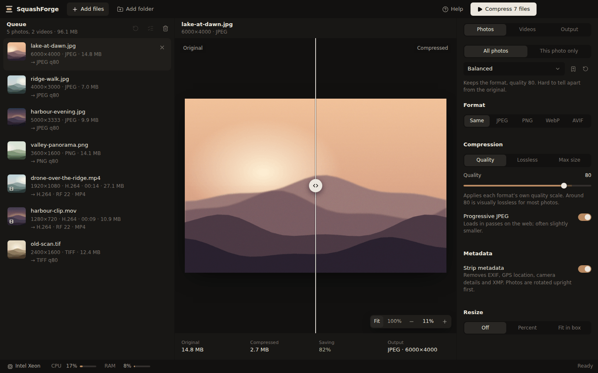
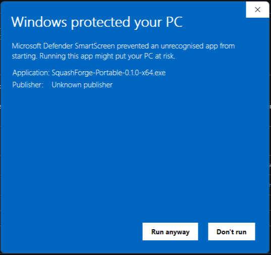
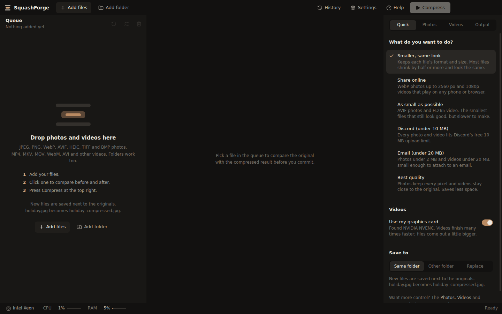
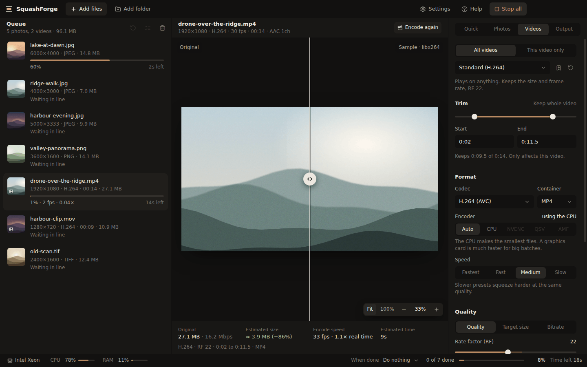
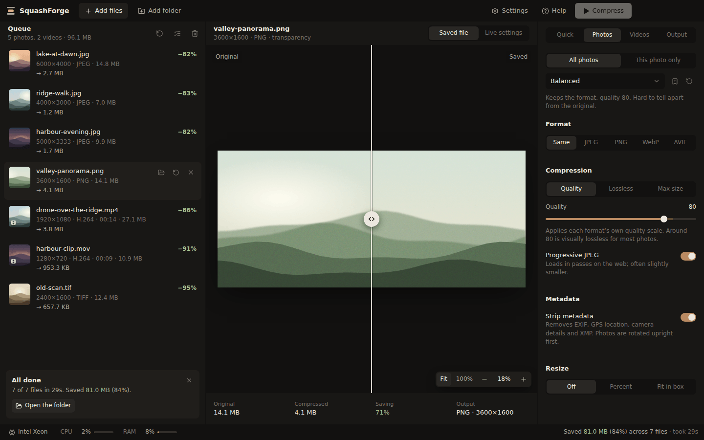
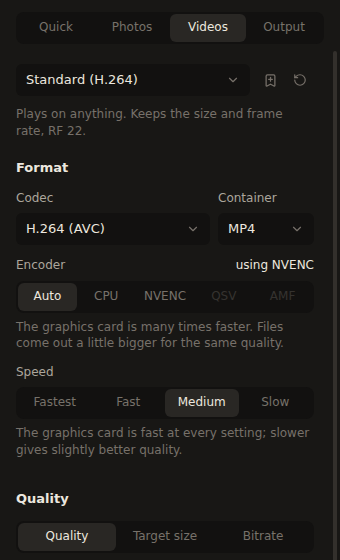
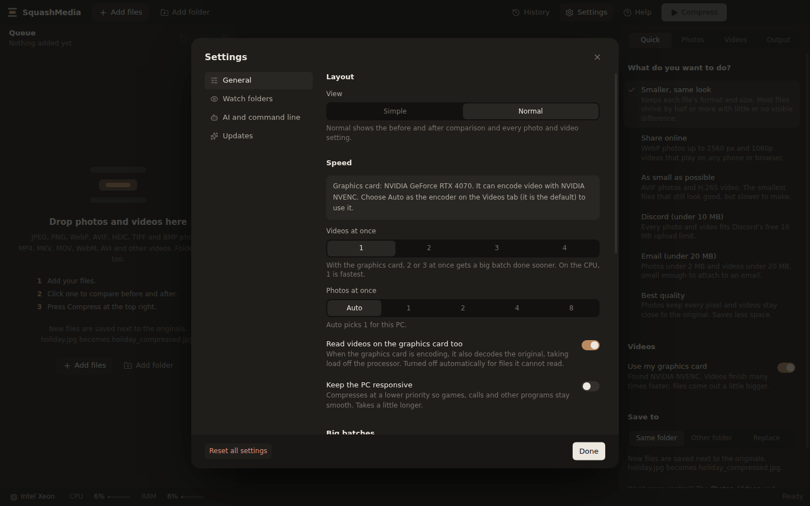
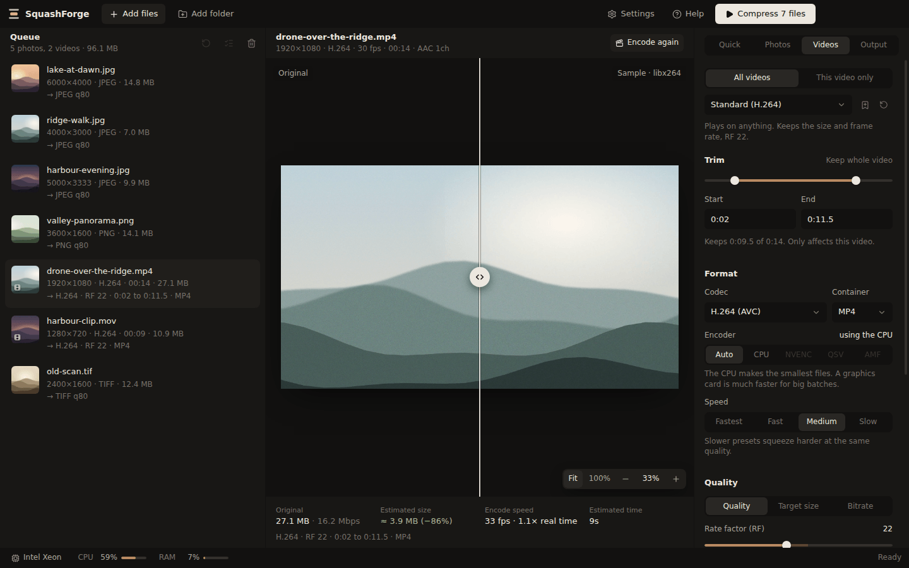
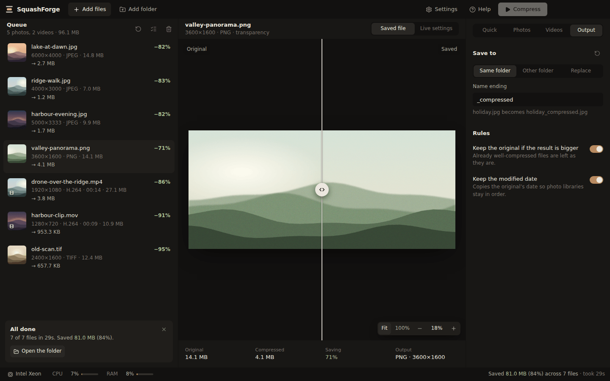
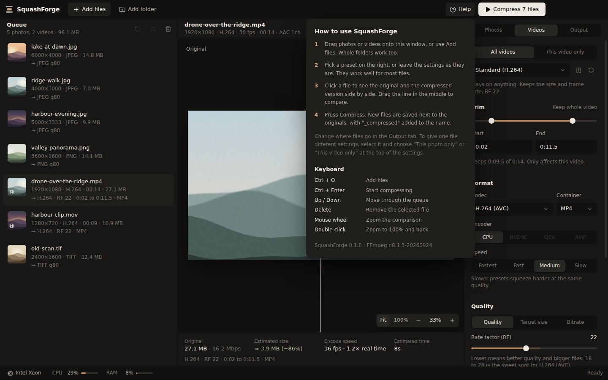

# SquashForge

SquashForge makes photos and videos smaller without making them look worse. You drop files in, check the before and after side by side, and press one button. It runs on Windows 10 and 11.

It does the job of two well-known free tools in one window: Caesium for photos and HandBrake for videos. Nothing is uploaded anywhere. Everything happens on your own PC.



## Contents

- [Install it](#install-it)
- [Compress your first files](#compress-your-first-files)
- [Lots of videos? Use your graphics card](#lots-of-videos-use-your-graphics-card)
- [Common jobs, step by step](#common-jobs-step-by-step)
- [What the settings mean](#what-the-settings-mean)
- [Something went wrong](#something-went-wrong)
- [Keyboard shortcuts](#keyboard-shortcuts)
- [For developers](#for-developers)

## Install it

1. Open the [latest release page](https://github.com/joshov13-dev/squash-media/releases/latest).
2. Scroll down to **Assets** and click `SquashForge-Setup-0.2.0-x64.exe` (the version number may be higher). Your browser saves it to your Downloads folder. Ignore the two **Source code** files; those are for programmers. If the Source code files are the only ones you can see, the release is brand new and its download is still being built. Wait five minutes and refresh the page.
3. Open your Downloads folder and double-click the file you just downloaded.
4. Windows will probably show a blue box that says **Windows protected your PC**. Don't worry: Windows shows this for any new program that hasn't paid for a code-signing certificate, and SquashForge hasn't (yet). To get past it:
   - Click the small underlined words **More info**, just under the message. At first the only button is **Don't run**, so it's easy to miss.
   - The box now shows the file name and a second button, **Run anyway**. Click **Run anyway**.

   

   You only need to do this once for each version you download.
5. The installer asks a couple of questions. The answers it already has are fine, so keep clicking **Next**, then **Install**, then **Finish**.
6. SquashForge opens. Next time, click the Start button and type `SquashForge`, or use the shortcut on your desktop.

### Would rather not install anything?

Download `SquashForge-Portable-0.2.0-x64.exe` instead and double-click it. You'll get the same blue box as above the first time: click **More info**, then **Run anyway**. After that it runs straight away without installing. It takes a few seconds longer to open each time, and the right-click menu in File Explorer only comes with the installed version.

### Removing it later

Open **Settings**, then **Apps**, find **SquashForge** in the list and click **Uninstall**. Your photos and videos are not touched.

## Compress your first files

### 1. Add your files

Drag photos or videos from File Explorer onto the SquashForge window. You can drag a whole folder too; SquashForge finds every photo and video inside it, including in subfolders. If you prefer buttons, use **Add files** or **Add folder** at the top left.



Your files appear in the list on the left, called the queue. You can mix photos and videos.

### 2. Check what you'll get

Click any photo in the queue. The big picture in the middle is split in two: the left half is your original, the right half is how it will look after compressing. Drag the round handle in the middle left and right to compare.

The numbers under the picture tell you the original size, the new size and how much you save.

To look closely, scroll your mouse wheel over the picture to zoom in, and drag to move around. Double-click to jump to 100% (one screen pixel per photo pixel) and double-click again to go back.

For a video, click **Preview sample**. SquashForge compresses 4 seconds from the middle of the video, shows you the same frame before and after, and estimates the final size and how long the whole video will take.

### 3. Say what you want (optional)

The panel on the right opens on the **Quick** tab. Pick what you want from the list and every photo and video setting is chosen for you. The first one, **Smaller, same look**, is already picked and suits most files, so you can skip this step.

| Pick this | When |
| --- | --- |
| Smaller, same look | You want smaller files that look exactly the same. Keeps each file's type and size. |
| Share online | Photos and videos are going on a website or social media. |
| As small as possible | Space matters most and you don't mind waiting a bit longer. |
| Discord (under 10 MB) | You're posting to Discord without Nitro. |
| Email (under 20 MB) | You're attaching things to an email. |
| Best quality | Nothing may look any different. Saves less space. |

The Quick tab also has **Use my graphics card** (see [below](#lots-of-videos-use-your-graphics-card)) and where to save the new files.

Want more control? The **Photos**, **Videos** and **Output** tabs have every setting, and each has its own preset menu at the top:

| Preset | Use it when |
| --- | --- |
| Balanced | You want smaller photos that look the same. |
| Web (WebP) | Photos are going on a website. |
| Smallest (AVIF) | Every kilobyte counts and you don't mind waiting a bit longer. |
| Lossless | Not a single pixel may change. Saves less space. |
| Under 500 KB, Under 2 MB | A form or website has a file size limit. |
| Standard (H.264) | You want a smaller video that plays on anything. |
| HQ 1080p (H.265) | You want the smallest file at high quality and your devices are less than about 8 years old. |
| Discord (10 MB), Discord (50 MB) | You're posting a video to Discord. |
| Email (20 MB) | You're attaching a video to an email. |

### 4. Press Compress

Click **Compress** at the top right. Each file shows its progress and how long it has left. The bar at the bottom of the window shows the whole queue.



You can keep using your PC while it works, but it may feel slower than usual because SquashForge uses the whole processor. If that bothers you, turn on **Keep the PC responsive** in **Settings**. Your PC won't go to sleep on its own until the queue is finished.

### 5. Find your new files

When everything is done, an **All done** box appears under the queue. Click **Open the folder** to see your new files.



Unless you change it, each new file is saved next to its original with `_compressed` added to the name. So `holiday.jpg` becomes `holiday_compressed.jpg`. Your originals are left alone.

If a compressed file would come out bigger than the original (it happens with files that were already squeezed hard), SquashForge keeps the original and says so.

## Lots of videos? Use your graphics card

Compressing video on the processor is slow. Most graphics cards from the last eight years or so have a separate video encoder built in, and it is many times faster: often the difference between a whole day and an hour or two for a big pile of videos. SquashForge works with NVIDIA (NVENC), Intel (Quick Sync) and AMD (AMF).

You don't need to do anything to turn it on. The video encoder is set to **Auto** from the start. Auto uses your graphics card if SquashForge found one that works when it opened, and the processor if not. To check, look at **Use my graphics card** on the **Quick** tab. It is switched on, and names your card's encoder, when one was found.



The trade-off is size: for the same quality, a graphics card makes files a little bigger than the processor does. Switch **Use my graphics card** off (or choose **CPU** as the encoder on the **Videos** tab) when you want the smallest possible files and have time to wait.

If the graphics card ever fails on a file, for example because of an old driver, SquashForge redoes that file on the processor and carries on with the rest. The file shows a short note saying so.

### Settings for big batches

Click **Settings** at the top of the window.



| Setting | What it does |
| --- | --- |
| Videos at once | How many videos are compressed side by side. With a graphics card, 2 or 3 gets a big batch done sooner. On the processor, leave it at 1. |
| Photos at once | How many photos are compressed side by side. **Auto** picks a number for your processor. |
| Read videos on the graphics card too | The graphics card also reads (decodes) the original video, taking more work off the processor. If it can't read a file, SquashForge reads that one on the processor instead. |
| Keep the PC responsive | Runs compression at a lower priority so games, video calls and other programs stay smooth. Takes a little longer. |
| Leave out earlier copies | When you add a folder, files ending in `_compressed` (your earlier results) are left out, so nothing gets compressed twice. |
| Skip files that are already done | If a file's compressed copy already exists, leave it. Handy for carrying on with a big batch another day: add the same folder again and press **Compress**. |
| Stop the PC going to sleep | Keeps the PC awake while files are being compressed, then lets it sleep as normal. |
| Show a notification when it finishes | Pops up a Windows notification when the queue is done and you're using another program. |
| Ask before quitting mid-way | Warns you if you close SquashForge while it's still working. |

**Reset all settings** at the bottom puts everything, including the tabs on the right, back to how it was on first launch. Presets you saved are kept.

A tip for really big jobs: add one folder at a time and use **When done** at the bottom of the window to put the PC to sleep when it's finished.

## Common jobs, step by step

### Make a video small enough for Discord

On the **Quick** tab, pick **Discord (under 10 MB)** and press **Compress**. (To do it for one video only, click the video, open the **Videos** tab, choose **This video only** and then **Discord (10 MB)** from the preset menu.) SquashForge works out the right quality for the length of your video. If the result still comes out too big, it tries again automatically.

For a different limit, change **Quality** to **Target size** and type the size in MB.

### Cut the start or end off a video

Click the video and open the **Videos** tab. Under **Trim**, drag the two dots on the slider, or type the start and end times (for example `0:02` and `1:15`). The trim only applies to that one video.



### Get photos under a size limit

Choose **Under 500 KB** or **Under 2 MB** from the Photos preset menu. For any other size, choose **Max size** under **Compression** and type the limit. SquashForge picks the best quality that fits. If even the lowest quality is too big, it shrinks the photo until it fits.

### Give one file different settings

Click the file, then choose **This photo only** (or **This video only**) at the top of the settings. Anything you change now only affects that file, and the queue marks it with "own settings". Choose **All photos** to put it back on the shared settings.

### Save everything into one folder

On the **Quick** or **Output** tab, choose **Other folder** and pick where the files should go. If you added a whole folder, **Keep subfolders** recreates its layout inside the destination, so two files called `IMG_0001.jpg` from different days won't clash.



### Replace the originals

Open the **Output** tab and choose **Replace**. Each compressed file takes the original's place, and the original goes to the Recycle Bin, so you can still get it back.

### Compress straight from File Explorer

If you installed SquashForge, right-click a photo, a video or a folder and choose **Compress with SquashForge**. On Windows 11, click **Show more options** first. You can also select lots of files, right-click, and choose **Send to**, then **SquashForge**.

### Let it run overnight

Once compressing has started, the bar at the bottom of the window shows **When done**. Choose **Sleep** or **Shut down**. When the queue finishes you get a minute to cancel before it happens.

### Pick a specific encoder

On the **Videos** tab, the **Encoder** row has **Auto**, **CPU**, **NVENC** (NVIDIA), **QSV** (Intel) and **AMF** (AMD). Auto is right for almost everyone. Greyed-out options mean that graphics card isn't in your PC, or its driver is too old for it.

## What the settings mean

Most options have a short explanation right under them in the app. Here is the longer version.

### Photos

| Setting | What it does |
| --- | --- |
| Format | **Same** keeps each file's type. **JPEG** works everywhere. **PNG** is for graphics and screenshots. **WebP** is about 30% smaller than JPEG and fine for websites. **AVIF** is the smallest but slowest to make. |
| Quality | 1 to 100. Around 80 looks the same as the original for most photos. Below 60 you may start to see blotches. |
| Lossless | Makes the file smaller without changing any pixels. For JPEGs it removes hidden data only. Saves less than Quality mode. |
| Max size | Finds the best quality that fits under a size you choose. |
| Strip metadata | Removes hidden information such as the camera model and the GPS location where the photo was taken. Good for privacy. Photos are turned the right way up first. |
| Resize | Makes photos smaller in pixels. **Percent** scales everything by the same amount. **Fit in box** keeps photos inside a width and height you choose. It never makes a photo bigger. |

### Videos

| Setting | What it does |
| --- | --- |
| Codec | **H.264** plays on everything. **H.265** makes files about half the size, but some older devices can't play it. **AV1** is the smallest but slow to make. **VP9** is mainly for websites. |
| Container | The file type: **MP4** for most uses, **MKV** keeps extra subtitle tracks, **WebM** is for websites. |
| Encoder | **Auto** uses your graphics card when it can and the processor when it can't. **CPU** gives the smallest files. **NVENC**, **QSV** and **AMF** force a particular graphics card encoder. |
| Speed | Slower settings squeeze the file harder at the same quality. |
| Quality | Lower numbers mean better quality and bigger files. The shaded part of the slider is the range most people use. |
| Target size | Aims for an exact file size instead of a quality level. |
| Resolution | Makes the picture smaller, for example 4K down to 1080p. It never makes a video bigger. |
| Frame rate | Caps the frames per second. 30 is plenty for most clips. |
| Audio | **Passthrough** keeps the sound exactly as it is. **AAC** and **Opus** re-compress it. **No audio** removes it. |

### Output

| Setting | What it does |
| --- | --- |
| Same folder | Saves the new file next to the original with an ending added to the name, `_compressed` unless you change it. |
| Other folder | Saves everything into a folder you choose. |
| Replace | The new file takes the original's place. Originals go to the Recycle Bin. |
| Keep the original if the result is bigger | Leaves files alone when compressing wouldn't help. |
| Keep the modified date | Gives the new file the same date as the original, so photo apps keep them in order. |

Your settings are remembered the next time you open SquashForge. The arrow button next to the preset menu puts a tab back to its defaults. The bookmark button saves your current settings as a preset of your own.

## Something went wrong

### "Windows protected your PC"

This is expected, for both the installer and the portable version. Click the small underlined **More info** under the message, then the **Run anyway** button that appears. There's a picture in [Install it](#install-it).

### A file has red text under it

That file couldn't be compressed, and the red text says why in plain words. Hover over it to see the technical details. The usual causes:

- The file is open in another program. Close it and click the circular arrow next to the file to try again.
- The disk is full, or you picked a folder you can't save to. Choose another folder in the **Output** tab.
- The file is damaged. Check it opens in another program.
- The graphics card failed and so did the processor. That usually means the file is damaged or in an unusual format.

### It says "Original kept"

The compressed version would have been bigger than the file you started with, so SquashForge left the original as it was. This is normal for files that were already compressed hard.

### I can't find my files

Click **Help** at the top of the window. It tells you exactly where new files are being saved with your current settings. You can also click the folder icon that appears when you hover over a finished file.

### I replaced my originals by mistake

They are in the Recycle Bin. Open it, select them and click **Restore**.

### Compressing a video is slow

Video takes time, especially long 4K videos. First check that **Use my graphics card** is on in the **Quick** tab (see [Lots of videos? Use your graphics card](#lots-of-videos-use-your-graphics-card)). You can also pick **Fast** or **Fastest** under **Speed**, or a lower **Resolution**. The time left shown next to each file gets more accurate the more you use SquashForge.

### "Use my graphics card" is greyed out

SquashForge didn't find a graphics card it can use for video. Updating your graphics driver (from NVIDIA, Intel or AMD's website) and restarting SquashForge often fixes it. Some older or very basic graphics chips have no video encoder at all; then videos use the processor.

### My PC is slow while it works

That is expected. SquashForge uses every processor core to finish sooner. Turn on **Keep the PC responsive** in **Settings** to let other programs go first. It goes back to normal when the queue is done.

## Keyboard shortcuts

| Keys | What it does |
| --- | --- |
| Ctrl + O | Add files |
| Ctrl + Enter | Start compressing |
| Up / Down arrows | Move through the queue |
| Delete | Remove the selected file from the queue (it stays on your disk) |
| Mouse wheel over the picture | Zoom in and out |
| Double-click the picture | Zoom to 100% and back |
| Double-click a finished file | Open the compressed file |



## For developers

SquashForge is an Electron app written in TypeScript, with a React 19, Tailwind CSS and Zustand interface. Photos go through [sharp](https://sharp.pixelplumbing.com) (libvips) and videos through a bundled FFmpeg.

### Build it

You need Node.js 22 or newer.

```bash
npm install
npm run fetch:ffmpeg      # downloads FFmpeg for Windows into binaries/win
npm run dist:win          # makes the installer and portable .exe in release/<version>
```

Build the Windows packages on Windows, because `npm install` fetches the image library for the machine it runs on. GitHub Actions does this for every push (the **Windows installer** job). The files are under that run's **Artifacts**.

### Run it while you work on it

```bash
npm run fetch:ffmpeg -- linux   # Linux only; on Windows use the command above
npm run dev                     # opens the app and reloads when you save
npm test                        # engine, queue and ETA tests, including real encodes
npm run typecheck
```

Without fetched binaries the app uses `ffmpeg` and `ffprobe` from your `PATH`. `SQUASHFORGE_FFMPEG_DIR` points it at another folder, and `SQUASHFORGE_USER_DATA` gives it a separate settings folder.

### Making a release

Push a tag that starts with `v`, for example `git tag v0.2.0 && git push origin v0.2.0`. The workflow builds the installer and portable exe and attaches both to a GitHub release, which is where the download links in this README point.

### How the code is laid out

```text
src/
├── main/                      Electron main process
│   ├── index.ts               window, taskbar progress, notifications, quit guard
│   ├── hardware.ts            CPU, GPU and RAM detection, encoder test runs
│   ├── systemMonitor.ts       live CPU, GPU and encoder load
│   ├── power.ts               sleep or shut down when the queue is done
│   ├── preferences.ts         the Settings window's options, as the queue sees them
│   ├── services/
│   │   ├── imageProcessor.ts  sharp pipelines, target-size search, previews
│   │   ├── jpegStrip.ts       lossless JPEG metadata removal
│   │   ├── bmp.ts             BMP decoder (sharp's libvips has none)
│   │   ├── videoProcessor.ts  ffprobe, FFmpeg arguments, two-pass, trims, previews
│   │   ├── etaCalculator.ts   hardware speed model, live ETA, per-PC calibration
│   │   ├── jobQueue.ts        photo and video lanes, safe saving, run totals
│   │   ├── friendlyErrors.ts  plain-English error messages
│   │   ├── mediaResolver.ts   expands dropped folders and reads media info
│   │   └── outputPaths.ts     output naming rules
│   └── ipc/handlers.ts        messages between the window and the main process
├── preload/index.ts           the window.api bridge
├── renderer/src/              the interface
└── shared/                    types, codec tables, presets, formatting
build/installer.nsh            adds the right-click menu and Send to entry
```

The build uses [electron-vite](https://electron-vite.org), so its config is `electron.vite.config.ts`. Packaging settings are in `electron-builder.json5`.

## Licences

SquashForge is MIT licensed. It ships the GPL "shared" build of FFmpeg from [BtbN/FFmpeg-Builds](https://github.com/BtbN/FFmpeg-Builds) as separate programs, with FFmpeg's licence in `resources/bin/FFMPEG-LICENSE.txt` inside the install folder. FFmpeg's source code is available from that project and from [ffmpeg.org](https://ffmpeg.org).
